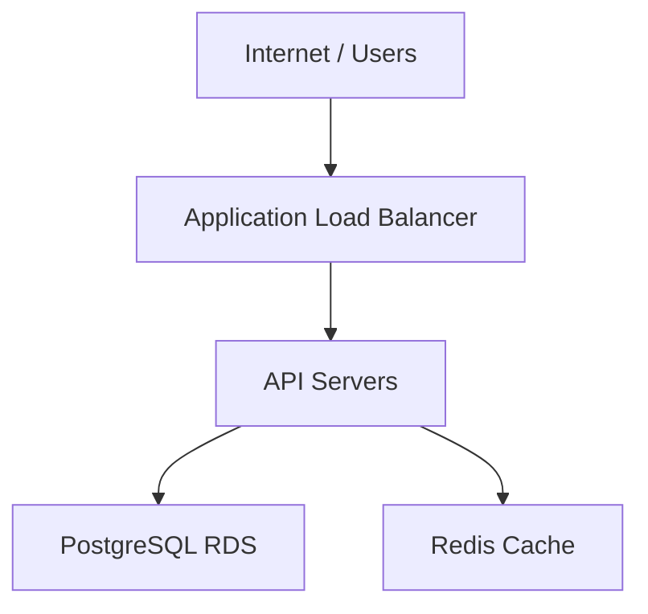

# Conjure — CLAUDE.md

This file gives you persistent context about the Conjure project. Read it at the start of every session before doing anything.

---

## What is Conjure?

Conjure is a **Prompt-to-Infrastructure** web app. Users describe or explore cloud infrastructure through a conversational chat interface. The AI generates and iterates on an architecture diagram (Mermaid) paired with a config file (YAML), then converts both into Terraform/OpenTofu HCL for deployment to AWS or GCP.

University project for NTU Cloud Computing (2026). Team of 2.

---

## Core model

The session is a **persistent chat** with a diagram panel alongside it. There is no rigid multi-stage pipeline — the user chats freely, and the AI decides what to do with each message.

### Dual source of truth: Mermaid + Config YAML

The infrastructure is defined by **two files that work as a pair**:

- **Mermaid** — topology only (what nodes exist and how they connect)
- **Config YAML** — everything else (resource types, instance sizes, networking, ports, all parameters)

Node IDs are the glue — every node ID in Mermaid has a corresponding entry in the config. If one has an ID the other doesn't, that's a validation error. Terraform HCL is always a **derived output** generated from the Mermaid + Config pair.

Example Mermaid:


Corresponding config YAML:
```yaml
nodes:
  alb_main:
    resource: aws_lb
    config:
      internal: false
      load_balancer_type: application
    networking:
      subnet: public

  asg_api:
    resource: aws_autoscaling_group
    config:
      min_size: 2
      max_size: 6
      desired_capacity: 2
      instance_type: t3.small
    networking:
      subnet: private

  rds_primary:
    resource: aws_db_instance
    config:
      engine: postgres
      engine_version: "15"
      instance_class: db.t3.micro
      multi_az: true
      allocated_storage: 20
    networking:
      subnet: private
      port: 5432
      sg_inbound: [asg_api]

  redis_cache:
    resource: aws_elasticache_cluster
    config:
      engine: redis
      node_type: cache.t3.micro
      num_cache_nodes: 1
    networking:
      subnet: private
      port: 6379
      sg_inbound: [asg_api]
```

### Message classification

**The AI classifies every user message into one of three categories:**

| Category | What changes | Code impact | Example prompts |
|---|---|---|---|
| **Topology change** | Mermaid + Config updated | If code exists → stale | "Add a NAT gateway", "Replace EC2 with Lambda", "Add a Redis cache" |
| **Config change** | Config updated. Mermaid unchanged. | If code exists → stale | "Set min instances to 3", "Change RDS to db.t3.small", "Use port 8080" |
| **Question / chat** | Neither | No impact | "What instance type should I use?", "Explain how VPCs work" |

**Stale rule is simple:** any change to either Mermaid or Config → if code exists, it goes stale. No exceptions. Code is never patched incrementally — it's always a full generation from the Mermaid + Config pair.

**On every topology change:** the AI always explains what it changed in the chat alongside the diagram update. The diagram never updates silently.

### Two LLM calls

| Call | Input | Output | Trigger |
|---|---|---|---|
| **Call 1** | User prompt + current Mermaid + current Config | Updated Mermaid and/or Config + chat explanation | Every topology or config message |
| **Call 2** | Full Mermaid + full Config | Terraform HCL files | "Generate Code" / "Regenerate" button only |

There is no Call 2b. Code is never touched incrementally.

---

## Session flow

1. User clicks **"New session"** → setup page appears (sidebar stays visible)
2. User configures: target environment (AWS / GCP), IaC tool, model, optional GitHub repo → clicks **"Start session"**
3. Main session screen opens: **chat panel (left) + diagram panel (right)**
4. User chats freely — AI responds with text, updates Mermaid + Config, or both
5. When happy with the diagram, user clicks **"Generate Code"** → Code and Deploy tabs appear
6. User can continue chatting — any Mermaid or Config change makes code stale
7. User configures credentials, region, and state backend in the **Deploy tab** when ready to provision
8. Deploy is always optional — many users just export code

Sessions are listed in the left sidebar, grouped by date, resumable at any point. Status pills: `Active / Deployed / Failed`.

---

## UI layout

### Main session screen

```
┌─────────────┬──────────────────────────────────────────────┐
│   Sidebar   │               Topbar (session name + badges) │
│  (sessions) ├──────────────────────────────────────────────┤
│  [toggle]   │  Chat panel   │   Diagram panel              │
│             │               │   [tab bar: Diagram | Code*  │
│             │               │    | Deploy*] [split icon]   │
│             │               │                              │
│             │               │   <tab content>              │
│             │               │                              │
│             ├───────────────┴──────────────────────────────┤
│             │  Chat input                                   │
└─────────────┴──────────────────────────────────────────────┘
* Code and Deploy tabs only appear after "Generate Code" is clicked
```

Topbar badges show: target environment (AWS / GCP), model, IaC tool. No region — region is set in Deploy tab.

### Diagram panel — tab behaviour

- **Default:** only the `Diagram` tab exists
- After "Generate Code": `Code` and `Deploy` tabs appear and persist for the session
- **Split view:** clicking the split icon splits into Diagram (left) | Code (right). Chat remains on far left. Split preference saved per user in account settings.
- When split is active: the split icon turns highlighted. Clicking it again collapses back to tabs.

### Diagram tab toolbar
- Edit mode toggle — when on, user can edit Mermaid code directly. On save, AI posts a summary of what changed into chat.
- Export Mermaid button
- Generate Code button (becomes Regenerate after first generation)

### Properties drawer
- Clicking a node in the diagram opens a side drawer showing that node's config from the YAML file
- Fields are **editable** — changes update the Config YAML and make code stale
- Source reference shown at bottom (e.g. `conjure.config.yaml → rds_primary`)
- This is the UI for config values that Mermaid can't represent

### Diagram node icons
Pre-defined SVG icons are shown for recognized resource types. Undefined types render as text-only labels.

**Currently defined icons (3):**

| Resource type | Icon | Description |
|---|---|---|
| VM / Server | Server rack | Rectangle with horizontal dividers and status dots |
| Database | Stacked cylinders | Classic DB symbol with three cylinder layers |
| Redis / Cache | Diamond | Diamond shape with crosshair lines |

All other resource types (Internet, Load Balancer, VPC, ASG, Bastion, NAT Gateway, etc.) render with text labels only — no icon. New icons can be added to the registry as needed.

Icons are defined as SVG `<symbol>` elements and referenced via `<use href>`. The icon registry maps resource type strings to symbol IDs.

### Code tab toolbar
- IaC badge showing tool and version (e.g. "Terraform v1.9" or "OpenTofu v1.8") — derived from session's `iac_tool` field
- File picker (main.tf, variables.tf, outputs.tf, modules/)
- Stale banner when Mermaid or Config has changed since last generation
- Split view / Copy / Download .zip buttons

### Deploy tab
Deploy tab is where all provisioning config lives. Nothing here is needed for diagram or code generation — only for running `terraform plan` and `terraform apply`.

**Sections:**

1. **Cloud Configuration** (required for plan/apply)
   - Credential: dropdown of saved profiles from Settings, OR "Use one-off keys" for inline entry
   - Region: pre-filled from credential profile's default region, editable

2. **State Backend** (required for plan/apply)
   - AWS target → S3 bucket, key prefix, region, DynamoDB table (optional)
   - GCP target → GCS bucket, prefix
   - For sessions from existing repos: auto-detected from `backend {}` block in `.tf` files, shown pre-filled
   - If no backend found in repo: warning, user must provide one

3. **Plan & Apply**
   - "Run Plan" — available once cloud config + state backend are filled
   - "Apply" — gated behind a successful plan
   - Plan output panel shows terraform plan summary

4. **Export** (always available, no config needed)
   - Download .zip
   - Open PR on GitHub (if session has a linked repo)

---

## Session setup

Shown as a full page (not a modal) when user clicks "New session". Sidebar stays visible. Fields:

| Field | Notes |
|---|---|
| Target environment | AWS / GCP |
| IaC tool | Terraform / OpenTofu |
| Model | One model per session, used for all LLM calls |
| GitHub repo (optional) | Repo picker from connected account. Disabled with warning if GitHub not connected in Settings. |

No credentials, no region, no state backend — those belong in the Deploy tab.

---

## LLM model selection

One model is chosen per session at setup and used for both LLM call types. Keeping one model ensures consistent context across diagram and code generation.

### Provider strategy

**Default:** OpenRouter (app-provided API key). Free-tier models available to all users out of the box.

**BYOK (Bring Your Own Key):** Users can add their own Anthropic API key in Account Settings to unlock premium models. These call the Anthropic API directly (not through OpenRouter).

### Available models

| Model | Provider | Tier | Requires |
|---|---|---|---|
| Gemini 2.0 Flash | OpenRouter | Free | Nothing (default) |
| Llama 3.3 70B | OpenRouter | Free | Nothing (default) |
| GPT-4o mini | OpenRouter | Free | Nothing (default) |
| Claude Sonnet | Anthropic (direct) | Premium | User's Anthropic API key |
| Claude Opus | Anthropic (direct) | Premium | User's Anthropic API key |

### SDK routing

| Scenario | SDK | Base URL |
|---|---|---|
| Free models (OpenRouter) | `openai` | `https://openrouter.ai/api/v1` |
| User's Anthropic key | `@anthropic-ai/sdk` | Anthropic default |

---

## Cloud credentials

Supported targets:
- **AWS** — EC2, RDS, ElastiCache, ALB, VPC, Auto Scaling
- **GCP** — Cloud Run, Cloud SQL, Memorystore

Credentials are managed in **Account Settings** via Supabase Vault:
- Multiple named profiles per provider (e.g. "Production", "Staging")
- Each profile stores access keys + a default region (convenience, not a constraint)
- Selected per-session in the **Deploy tab** when the user is ready to provision

One-off keys can also be entered directly in the Deploy tab without saving a profile.

---

## State backend

Terraform requires a remote state backend to run `plan` and `apply` server-side. Configured in the Deploy tab.

- **New sessions:** user provides backend config (S3/GCS bucket, key prefix, etc.)
- **Sessions from existing repo:** Conjure scans `.tf` files for `backend {}` blocks and auto-populates the fields. If no backend block is found, a warning is shown and user must provide one to enable plan/apply.

State backend is only needed for plan/apply. Export (download .zip, Open PR) works without it.

---

## GitHub integration

Connected once via OAuth in Account Settings (scopes: `read:repo`, `write:repo`, `pull_requests`). Repo chosen per-session in the setup page (optional).

GitHub actions (Open PR, push to branch) are available in the Deploy tab's Export section — not in session setup.

---

## Existing repo sessions

When a session is started with a GitHub repo selected:

1. Conjure clones the repo and scans for `.tf` files
2. Parses existing Terraform to generate a Mermaid diagram + Config YAML
3. Renders the diagram and notifies the user: "This is your current infrastructure"
4. Code tab is pre-populated with the existing `.tf` files
5. Backend config is auto-detected from `backend {}` blocks
6. User can modify the architecture from this baseline

---

## Tech stack

| Layer | Technology | Notes |
|---|---|---|
| Frontend | Next.js (React) | App router |
| Backend | Next.js API routes | Monorepo, same deployment |
| Database | Supabase (Postgres) | Free tier |
| Auth | Supabase Auth | GitHub OAuth + email/password (with email confirmation) |
| Credential encryption | Supabase Vault | For storing user cloud credentials |
| ORM | Prisma | Type-safe DB access |
| Diagram format | Mermaid.js | Client-side rendering |
| Config format | YAML | Paired with Mermaid as dual source of truth |
| IaC | Terraform / OpenTofu | User's choice per session |
| LLM routing | OpenRouter (default, free models) | Via `openai` SDK with custom base URL |
| LLM BYOK | Anthropic | Direct SDK when user provides their own key |
| Fonts | Plus Jakarta Sans (headings), Inter (body), JetBrains Mono (code) | Google Fonts, loaded via `next/font` |
| Deployment | Vercel | Free tier |

---

## Project structure

```
conjure/
├── CLAUDE.md                          ← you are here
├── README.md
├── docs/
│   └── conjure-mockup-v3.html         ← approved UX mockup (source of truth for UI)
├── app/                               ← Next.js app router
│   ├── (auth)/
│   │   ├── login/
│   │   └── register/
│   ├── (app)/
│   │   ├── layout.tsx                 ← sidebar shell
│   │   ├── session/
│   │   │   ├── new/                   ← session setup page
│   │   │   └── [id]/
│   │   │       └── page.tsx           ← main session view (chat + diagram panel)
│   │   └── settings/
│   │       ├── credentials/
│   │       └── github/
│   └── api/
│       ├── sessions/
│       ├── generate/
│       │   ├── diagram/               ← Call 1: prompt → Mermaid + Config YAML
│       │   └── code/                  ← Call 2: Mermaid + Config → Terraform HCL
│       ├── classify/                  ← classifies prompt as topology / config / question
│       ├── deploy/
│       │   ├── plan/                  ← terraform plan execution
│       │   └── apply/                 ← terraform apply execution
│       └── credentials/
├── components/
│   ├── session/
│   │   ├── ChatPanel/
│   │   ├── DiagramPanel/
│   │   ├── PropertiesDrawer/          ← node config editor (reads/writes Config YAML)
│   │   ├── CodePanel/
│   │   └── DeployPanel/
│   └── ui/                            ← shared primitives
├── lib/
│   ├── llm/
│   │   ├── prompts/                   ← versioned prompt templates (never hardcode)
│   │   ├── classify.ts                ← topology / config / question classifier
│   │   ├── diagram.ts                 ← Call 1 wrapper
│   │   └── codegen.ts                 ← Call 2 wrapper
│   ├── mermaid/                       ← Mermaid validation helpers
│   ├── config/                        ← Config YAML parsing, validation, node ID sync
│   ├── icons/                         ← SVG icon registry for diagram nodes
│   │   ├── registry.ts               ← maps resource type → icon symbol ID
│   │   ├── vm.svg                     ← server rack icon
│   │   ├── database.svg               ← stacked cylinders icon
│   │   └── redis.svg                  ← diamond icon
│   ├── terraform/                     ← plan/apply execution, HCL validation
│   ├── vault/                         ← Supabase Vault helpers
│   └── supabase/                      ← Supabase client setup
├── prisma/
│   └── schema.prisma
├── terraform-templates/               ← base templates per provider
│   ├── aws/
│   └── gcp/
└── tests/
    ├── llm/                           ← LLM output parsing tests (high priority)
    ├── config/                        ← Config YAML ↔ Mermaid sync tests
    ├── mermaid/
    └── terraform/
```

---

## Database schema (key tables)

```
sessions:
├── id                 UUID
├── user_id            UUID (FK → users)
├── name               text
├── target_env         text (aws / gcp)
├── iac_tool           text (terraform / opentofu)
├── model              text
├── mermaid_code       text              ← topology source of truth
├── config_yaml        text              ← config source of truth (YAML string)
├── terraform_code     jsonb (nullable)  ← generated output, null until Generate Code
├── terraform_stale    boolean           ← true when mermaid/config changed after last generation
├── github_repo        text (nullable)
├── status             text (active / deployed / failed)
├── created_at         timestamp
└── updated_at         timestamp

credential_profiles:
├── id                 UUID
├── user_id            UUID (FK → users)
├── provider           text (aws / gcp)
├── name               text (e.g. "Production")
├── credentials        text (encrypted via Supabase Vault)
├── default_region     text
├── created_at         timestamp
└── updated_at         timestamp
```

---

## Environment variables

All secrets via environment variables, never hardcoded. See `.env.example`.

```env
# Supabase
NEXT_PUBLIC_SUPABASE_URL=
NEXT_PUBLIC_SUPABASE_ANON_KEY=
SUPABASE_SERVICE_ROLE_KEY=

# LLM — OpenRouter (required, powers free-tier models)
OPENROUTER_API_KEY=

# Database (Prisma)
DATABASE_URL=
```

User-provided Anthropic keys are stored per-user in Supabase Vault (not in env vars).

---

## Key technical decisions (locked — do not revisit without discussion)

| Decision | Choice | Reason |
|---|---|---|
| Dual source of truth | Mermaid (topology) + Config YAML (everything else) | Mermaid can't represent config values; YAML pairs cleanly with it |
| Config format | YAML | Human-readable, LLM-generatable, diffable |
| Diagram format | Mermaid.js | Text-based, LLM-generatable, client-side renderable, diffable |
| IaC | Terraform / OpenTofu | Standard, declarative, multi-provider |
| Stale code | Any Mermaid or Config change → stale | Simple rule, no incremental patching, user stays in control |
| No local deployment | Removed (was kind) | Conjure is a web app; local clusters don't fit the model |
| Credential storage | Supabase Vault | Already in stack, encrypted at rest |
| Credentials in Deploy tab | Not in session setup | Many users just want code, not deploy access |
| State backend in Deploy tab | Not in session setup | Only needed for plan/apply, not for code generation |
| Monorepo | Yes (Next.js) | Simpler for a 2-person team |
| One model per session | Locked at setup | Consistent context across all LLM calls |
| Split view | Saved per user account | Persists across sessions as a preference |
| UI layout | Chat + tabbed diagram panel | Conversational, not a rigid pipeline |
| Node icons | Pre-defined SVG only (3 types) | VM, Database, Redis. Undefined types show text only. |
| Auth providers | GitHub OAuth + email/password | No Google OAuth — GitHub covers the primary use case |
| Font stack | Plus Jakarta Sans / Inter / JetBrains Mono | Heading / body / code separation for premium SaaS feel |

---

## Security

Security is not optional — Conjure handles cloud credentials and executes infrastructure changes. Every layer must assume the client is hostile.

### Principles

1. **Never trust the client** — all input from the browser (form data, URL params, request bodies) is untrusted. Validate and sanitize server-side.
2. **Least privilege** — the anon key can only do what RLS policies allow. The service role key is server-only, never exposed to the browser.
3. **Defense in depth** — multiple layers (middleware, RLS, API validation) so a single failure doesn't compromise the system.

### Authentication & authorization

| Layer | What it does |
|---|---|
| Middleware (`middleware.ts`) | Checks Supabase session cookie on every request. Redirects unauthenticated users to `/login`. |
| Supabase RLS | Every table has Row Level Security enabled. Users can only read/write their own rows. No exceptions. |
| API route validation | Every API route calls `supabase.auth.getUser()` server-side. Never rely on the client-sent user ID. |
| Service role key | Used only in server-side code for admin operations (e.g., Vault access). Never in client bundles. |

### Input validation & sanitization

| Surface | Threat | Mitigation |
|---|---|---|
| Mermaid code (user-edited) | XSS via malicious Mermaid syntax | Mermaid.js `securityLevel: 'strict'` — disables HTML in diagrams. Validate before rendering. |
| Config YAML (user-edited) | YAML injection, prototype pollution | Parse with `yaml` library in safe mode. Validate against schema before storing. |
| Chat input | Prompt injection, XSS | Sanitize before rendering in chat. LLM output treated as untrusted — never render raw HTML from LLM responses. Use text content or a sanitizer like DOMPurify. |
| Terraform HCL (generated) | Code injection via LLM output | HCL is generated server-side and shown read-only. Validate syntax before plan/apply. |
| Properties drawer (node editing) | Arbitrary values in config | Validate field types and ranges server-side before updating Config YAML. |
| URL params / search params | Parameter tampering | Server-side validation. Never use client-provided session IDs without checking ownership via RLS. |

### Credential handling

- Cloud credentials (AWS/GCP keys) encrypted via **Supabase Vault** — never stored in plaintext
- Credentials decrypted only at the moment of `terraform plan/apply`, in server-side code
- User-provided Anthropic API keys stored in Vault, same as cloud credentials
- **No credentials in URL params, query strings, or client-side storage**
- One-off credentials (entered in Deploy tab without saving) held in memory only for the duration of the operation

### Browser security

- `NEXT_PUBLIC_*` env vars are the only values that reach the browser — these are designed to be public
- `SUPABASE_SERVICE_ROLE_KEY` and `DATABASE_URL` are server-only — Next.js strips non-`NEXT_PUBLIC_*` vars from client bundles
- Browser DevTools (inspect, console, network tab) cannot access server-side secrets
- Auth cookies are `HttpOnly` + `SameSite=Lax` — JavaScript cannot read them, CSRF is mitigated
- All Supabase requests go through RLS — even if someone crafts raw API calls from the console, they can only access their own data

### Rate limiting

- Auth endpoints (login, register) — rate limited to prevent brute force
- LLM API routes — rate limited per user to prevent abuse of free-tier models
- Deploy endpoints (plan, apply) — rate limited to prevent runaway infrastructure operations

### Environment variables

- All secrets via `.env.local`, never hardcoded
- `.env.local` is in `.gitignore` — never committed
- `.env.example` contains only key names, no values
- **Never read `.env.local` in AI assistant conversations** — secrets get sent to the LLM provider

---

## Git conventions

- Commit messages must be **concise** — one short line describing what changed
- **Never include co-author lines** — `Co-authored-by` is strictly banned from all commits
- Use feature branches, PR back to `main`
- Good: `add credential selector to deploy tab`, `fix: stale banner not showing on config change`
- Bad: `updated some files`, multi-paragraph messages, anything with `Co-authored-by`

---

## Code quality & readability

Readability is a first-class concern. Code will be read far more than it is written.

**Naming**
- Use clear, descriptive names — prefer `generateDiagramFromPrompt` over `genDiag` or `fn`
- Booleans read as statements: `isDeploying`, `hasCredentials`, `canProceed`
- Constants in SCREAMING_SNAKE_CASE, types/interfaces in PascalCase, everything else in camelCase

**Functions**
- Small and single-purpose — if a function needs a comment to explain what it does, split or rename it
- Prefer pure functions; isolate side effects at the edges (API routes, DB calls)
- No functions longer than ~40 lines without a strong reason

**Comments**
- Comment the *why*, not the *what*
- Remove commented-out code before committing

**Structure**
- Co-locate related files — component, types, and hooks together
- Use early returns to avoid deeply nested conditionals
- No magic numbers or strings — define named constants

**Best practices**
- Follow the [Airbnb JavaScript Style Guide](https://github.com/airbnb/javascript) for JS/TS baseline
- Follow [Next.js App Router best practices](https://nextjs.org/docs/app/building-your-application) — server components by default, client components only when needed
- Follow [Prisma best practices](https://www.prisma.io/docs/orm/prisma-client/queries/best-practice) — no raw SQL unless absolutely necessary
- TypeScript strictly — no `any`, no `as unknown as`, no suppressed errors
- Handle errors explicitly — never swallow exceptions silently

**Testing priorities (highest risk paths)**
- LLM output parsing — Mermaid validation, Config YAML validation
- Mermaid ↔ Config node ID sync — mismatched IDs break everything
- Prompt classifier (topology vs config vs question) — wrong classification breaks the whole model
- Supabase Vault read/write for credentials
