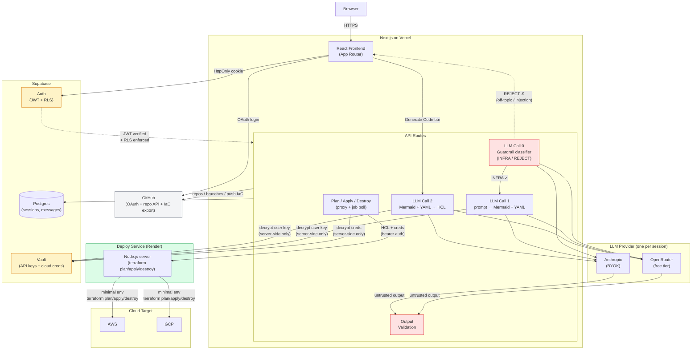

<p align="center">
  
</p>

# Conjure

> Describe your infrastructure. We generate the diagram, the code, and provision it.

Conjure is a **Prompt-to-Infrastructure** web app. Chat with an AI about your cloud infrastructure: it generates and iterates on an architecture diagram in real time, then converts it to IaC HCL you can deploy to AWS or GCP.

---

## How it works

Start a session, describe your infrastructure, and chat freely. Conjure classifies each message and decides what to do:

| What you say | What happens |
|---|---|
| "Add a Redis cache" | Diagram + config update, AI explains the change |
| "Set min instances to 3" | Config updated, code marked stale |
| "What instance type should I use?" | AI answers in chat, nothing changes |

Your infrastructure is defined by two files that work as a pair:

- **Mermaid diagram**: topology (what exists and how it connects)
- **Config YAML**: everything else (resource types, instance sizes, ports, networking)

Together they are the source of truth. IaC HCL is always derived from them; never edited directly.

When the diagram looks right, click **Generate Code** and Terraform HCL appears alongside, ready to download.

---

## Features

- **Conversational infrastructure design**: iterate through chat, not forms
- **Live architecture diagram**: Mermaid-based, updates as you chat
- **Dual source of truth**: Mermaid (topology) + Config YAML (parameters), always in sync
- **Properties drawer**: click any node to see and edit its config inline
- **Multi-provider**: AWS and GCP
- **Free by default**: free LLM models via OpenRouter, no API key needed to start
- **Bring your own key**: add your own Anthropic API key for premium Claude models
- **Plan & Apply**: run `terraform plan` and `terraform apply` from the Deploy tab via a cloud-isolated deploy service
- **Credential profiles**: save named AWS/GCP credential profiles in Account Settings; pick one per deploy
- **State backend**: configure S3 or GCS remote state; apply always runs against the same inputs that were planned
- **Destroy infrastructure**: tear down provisioned resources via a Danger Zone confirmation flow in the Deploy tab
- **Export code**: download generated IaC as a .zip, or push directly to a GitHub branch from the Deploy tab
- **Session history**: all sessions saved and resumable; in-flight jobs resume polling on page reload

---

## Tech stack

| Layer | Technology |
|---|---|
| Frontend + Backend | Next.js (App Router, API routes) |
| Database | Supabase (Postgres) |
| Auth | Supabase Auth (GitHub OAuth, email/password) |
| Credential storage | Supabase Vault |
| ORM | Prisma |
| Diagrams | Mermaid.js |
| Config format | YAML |
| IaC output | Terraform |
| LLM (default) | OpenRouter (free models) |
| LLM (BYOK) | Anthropic |
| App deployment | Vercel |
| Deploy service | Render |

---

## Architecture



**How it works:** Each user message triggers up to three LLM calls. **Call 0** (guardrail) classifies the input as infrastructure-related or off-topic: rejected messages never reach the main model, blocking prompt injection and misuse. **Call 1** takes the approved prompt plus the current Mermaid + Config YAML and generates updates with a chat explanation. **Call 2** is triggered separately by the "Generate Code" button, converting the full Mermaid + Config pair into Terraform HCL. All session data is persisted in Supabase Postgres with Row Level Security. Users start with free models via the app-provided OpenRouter key, and can bring their own Anthropic API key for premium Claude models.

**Deploy service:** Plan and Apply are handled by a separate Node.js service (Render) that runs `terraform` in an isolated subprocess. The Vercel API routes proxy the request, poll for results, and persist job status to the DB. Each Terraform process gets a minimal environment allowlist — `process.env` is never spread — and `HOME` is set to an ephemeral job directory so the container's own credential files can't be found at well-known paths. Credentials are passed only for the duration of the job and deleted with the temp directory on cleanup.

**Plan–apply binding:** `terraform apply` always reads the region, state backend, and credential profile from the DB row written at plan time — not from the apply request. This ensures apply always runs against exactly what was reviewed (same cloud account, same region, same backend), even if the user changes inputs in the UI between plan and apply. Mismatched credentials are rejected with a 409.

**Security boundaries:** Auth and Vault (amber) are the trust boundaries. Input Guardrails and Output Validation (red) are the LLM security layer. The browser only holds an HttpOnly session cookie; no secrets reach the client. Every API request is authenticated via JWT and scoped by Supabase RLS so users can only access their own data. Credentials and API keys are encrypted at rest in Vault and decrypted server-side only at the moment of use.

**LLM security:** User input passes through guardrails (length limits, prompt injection pre-filter) before reaching the LLM. All LLM output is treated as **untrusted**: Mermaid is validated and rendered with `securityLevel: 'strict'` (no embedded HTML), Config YAML is parsed in safe mode and validated against a schema, and generated HCL is syntax-checked before display. This prevents prompt injection, XSS via diagram output, and malformed infrastructure code.

---

## Getting started

**Prerequisites:** Docker, Node.js 20+

```bash
git clone https://github.com/yourname/conjure.git
cd conjure
npm install                    # local deps (IDE autocomplete)
cp .env.example .env.local     # fill in API keys
docker compose up --build      # start dev server
```

Open [http://localhost:3000](http://localhost:3000).

For detailed setup, architecture, and coding conventions, see the [Development Guide](docs/DEVELOPMENT.md).

---

## Security

Conjure handles cloud credentials and infrastructure operations. Security is built into every layer:

- **Authentication**: Supabase Auth with email/password and GitHub OAuth. All app routes are protected by middleware.
- **Row Level Security**: every database table enforces RLS. Users can only access their own sessions, credentials, and data.
- **Credential encryption**: AWS/GCP keys and user-provided LLM API keys (Anthropic) are stored via Supabase Vault (encrypted at rest). Decrypted only server-side at the moment of use.
- **Terraform env isolation**: each `terraform` subprocess receives a minimal environment allowlist (`PATH`, `HOME=<jobDir>`, `TF_INPUT=false`, provider credentials only). `process.env` is never spread into the child process, preventing deploy service secrets (e.g. `DEPLOY_SERVICE_API_KEY`) from being visible inside Terraform's execution environment.
- **Input sanitization**: Mermaid diagrams rendered with `securityLevel: 'strict'`. YAML parsed in safe mode. LLM output treated as untrusted. Registration names trimmed and length-capped before storage.
- **Server-side validation**: all API routes verify authentication and validate input. Session names (100-char cap), GitHub repo format (`owner/repo`), and enum fields (target env, IaC tool, model) are all validated server-side.
- **No secrets in the browser**: only `NEXT_PUBLIC_*` env vars reach the client. Service keys, database URLs, and credentials are server-only.
- **Rate limiting**: sliding window limiter on LLM chat (10/min), API key management (5/min), and session creation (5/min) per user. Auth endpoints rate-limited by Supabase.
- **Open redirect protection**: OAuth callback validates the `next` redirect param to block protocol-relative and external redirects.

