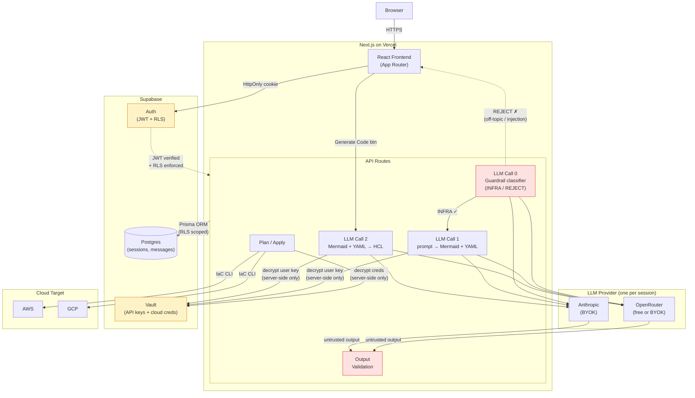

<p align="center">
  
</p>

<h1 align="center">Conjure</h1>

<p align="center">Describe your infrastructure. We generate the diagram, the code, and provision it.</p>

Conjure is a **Prompt-to-Infrastructure** web app. Chat with an AI about your cloud infrastructure — it generates and iterates on an architecture diagram in real time, then converts it to Terraform/OpenTofu HCL you can deploy to AWS or GCP.

---

## How it works

Start a session, describe your infrastructure, and chat freely. Conjure classifies each message and decides what to do:

| What you say | What happens |
|---|---|
| "Add a Redis cache" | Diagram + config update, AI explains the change |
| "Set min instances to 3" | Config updated, code marked stale |
| "What instance type should I use?" | AI answers in chat, nothing changes |

Your infrastructure is defined by two files that work as a pair:

- **Mermaid diagram** — topology (what exists and how it connects)
- **Config YAML** — everything else (resource types, instance sizes, ports, networking)

Together they are the source of truth. Terraform/OpenTofu HCL is always derived from them — never edited directly.

When the diagram looks right, click **Generate Code** → choose Terraform or OpenTofu, and HCL appears alongside. Deploy from the browser, or export to your own repo.

---

## Features

- **Conversational infrastructure design** — iterate through chat, not forms
- **Live architecture diagram** — Mermaid-based, updates as you chat
- **Dual source of truth** — Mermaid (topology) + Config YAML (parameters), always in sync
- **Properties drawer** — click any node to see and edit its config inline
- **Multi-provider** — AWS and GCP
- **Free by default** — free LLM models via OpenRouter, no API key needed to start
- **Bring your own key** — add your own OpenRouter or Anthropic API key for premium models
- **Deploy from the browser** — configure credentials, state backend, run plan and apply
- **Export without deploying** — download .zip or open a PR directly
- **Visualize existing infra** — import a GitHub repo and Conjure renders what's already there
- **Split view** — diagram and code side by side
- **Session history** — all sessions saved and resumable

---

## Tech stack

| Layer | Technology |
|---|---|
| Frontend + Backend | Next.js (App Router, API routes) |
| Database | Supabase (Postgres) |
| Auth | Supabase Auth (GitHub OAuth, email/password) |
| Credential storage | Supabase Vault |
| ORM | Prisma |
| Diagrams | Mermaid.js |
| Config format | YAML |
| IaC output | Terraform / OpenTofu |
| LLM (default) | OpenRouter (free models) |
| LLM (BYOK) | Anthropic + OpenRouter |
| Deployment | Vercel |

---

## Architecture



**How it works:** Each user message triggers up to three LLM calls. **Call 0** (guardrail) classifies the input as infrastructure-related or off-topic — rejected messages never reach the main model, blocking prompt injection and misuse. **Call 1** takes the approved prompt plus the current Mermaid + Config YAML and generates updates with a chat explanation. **Call 2** is triggered separately by the "Generate Code" button, converting the full Mermaid + Config pair into Terraform/OpenTofu HCL. When the user is ready to deploy, the Plan/Apply route decrypts cloud credentials from Vault and runs the IaC tool against the target provider. All session data is persisted in Supabase Postgres with Row Level Security. Users start with free models via the app-provided OpenRouter key, and can bring their own OpenRouter or Anthropic key for premium models.

**Security boundaries:** Auth and Vault (amber) are the trust boundaries. Input Guardrails and Output Validation (red) are the LLM security layer. The browser only holds an HttpOnly session cookie — no secrets reach the client. Every API request is authenticated via JWT and scoped by Supabase RLS so users can only access their own data. Credentials and API keys are encrypted at rest in Vault and decrypted server-side only at the moment of use.

**LLM security:** User input passes through guardrails (length limits, prompt injection pre-filter) before reaching the LLM. All LLM output is treated as **untrusted** — Mermaid is validated and rendered with `securityLevel: 'strict'` (no embedded HTML), Config YAML is parsed in safe mode and validated against a schema, and generated HCL is syntax-checked before display. This prevents prompt injection, XSS via diagram output, and malformed infrastructure code.

---

## Getting started

**Prerequisites:** Docker, Node.js 20+

```bash
git clone https://github.com/yourname/conjure.git
cd conjure
npm install                    # local deps (IDE autocomplete)
cp .env.example .env.local     # fill in API keys
docker compose up --build      # start dev server
```

Open [http://localhost:3000](http://localhost:3000).

For detailed setup, architecture, and coding conventions, see the [Development Guide](docs/DEVELOPMENT.md).

---

## Security

Conjure handles cloud credentials and infrastructure operations. Security is built into every layer:

- **Authentication** — Supabase Auth with email/password and GitHub OAuth. All app routes are protected by middleware.
- **Row Level Security** — every database table enforces RLS. Users can only access their own sessions, credentials, and data.
- **Credential encryption** — AWS/GCP keys and user-provided LLM API keys (OpenRouter, Anthropic) are stored via Supabase Vault (encrypted at rest). Decrypted only server-side at the moment of use.
- **Input sanitization** — Mermaid diagrams rendered with `securityLevel: 'strict'`. YAML parsed in safe mode. LLM output treated as untrusted.
- **Server-side validation** — all API routes verify authentication and validate input. Client data is never trusted.
- **No secrets in the browser** — only `NEXT_PUBLIC_*` env vars reach the client. Service keys, database URLs, and credentials are server-only.
- **Rate limiting** — auth, LLM, and deploy endpoints are rate limited to prevent abuse.

---

## Academic context

Built for NTU SC4052 Cloud Computing (2026).

This project explores **topology as a programmable entity** — infrastructure intent is declared through a structured, AI-generated diagram paired with a configuration file, and a generative AI layer produces validated, deployable IaC. A conversational interface makes this loop feel natural rather than mechanical.

---

## Team

| Name | Student ID |
|---|---|
| — | — |
| — | — |

---

## License

MIT
